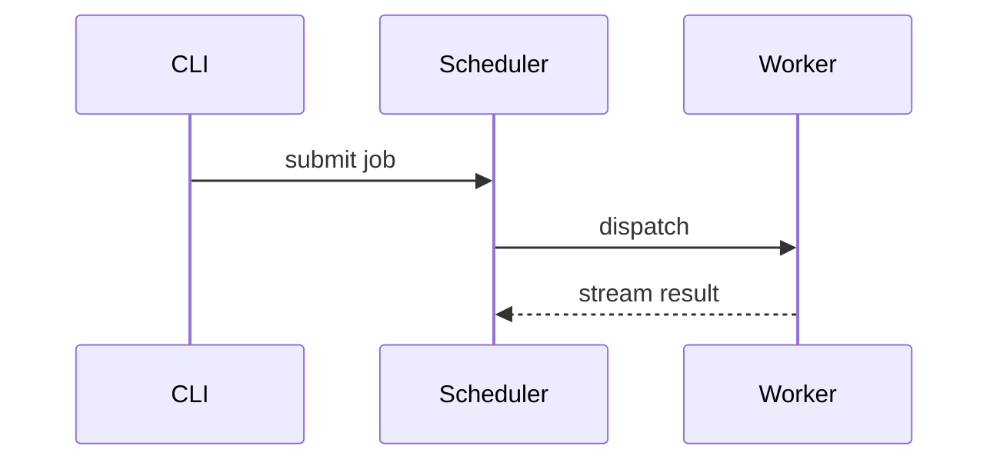

# git-pr-review

Review a GitHub PR, leave the feedback as inline draft comments, and never send it unless the user says so.

- If the user hasn't named a PR, ask which one.
- Ask what else they want you to check beyond the basics, since it changes per review: parity with a reference implementation, a particular concern, an area to focus on or skip. Take the answer as your standing instructions for this review.
- Draft only. Build a pending review; submit or discard only when the user says so.
- Every reviewer, judge, fix-verifier, and proofreader subagent runs at the highest-intelligence model and the highest reasoning effort available. Sonnet or haiku is for exploration only (fetching a reference, skimming a file); never let one of them find, judge, verify, or proofread.
- Report to the user, never to the PR author. Even an "LGTM" is for the user.
- Besides the findings, open the report with an overview that gets the user to understand the change and where it sits. See [§ Overview](#overview).

## The review

Run this as a reviewer/judge workflow (the Workflow tool): reviewer subagents find the issues, then an independent judge tries to refute each one before it survives. Demand evidence, not conclusions, and re-verify the survivors yourself.

Every `agent()` call that finds or judges a finding sets `model: 'opus', effort: 'max'`, the highest-intelligence model and reasoning effort Workflow offers. Never leave a reviewer or judge at an inherited or default model; that's for exploration subagents only (fetching a linked doc, skimming an unrelated file), not for anything that decides whether the code is right.

Each reviewer and judge writes its full work to `$STATE/evidence/<agent>.md` before returning, and returns that path with its findings. Tell every subagent, in its prompt, that this file takes everything raw and nothing summarized:

- Every code path it traced, quoted verbatim with `file:line`, not described.
- Every experiment and test it ran: the complete test or script source, the exact command line, the working directory and any overlay or setup, and the full unedited output, failures and passes alike.
- Every dead end and refuted theory, with why the evidence killed it.
- What it never checked, so the next reader doesn't mistake silence for coverage.

Length is not a concern here and paraphrase is the failure mode. The returned findings are the summary; the file is the raw record that lets you re-verify, re-anchor, reword, or defend any comment weeks later without running the review again. Anything only in a subagent's head is lost the moment it returns, so if an agent returns without its file, or with a thin one, send it back to write the full version before you use its findings.

Check that the change is idiomatic, simple, and correct, and that it fully solves the linked issue. Read the linked issue(s) and anything the user asked you to check against (a reference implementation, a spec), and confirm the behavior matches.

Verify, don't skim. Isolate the PR in a throwaway worktree (`git fetch origin pull/<pr>/head:pr-<pr>` then `git worktree add /tmp/pr-<pr> pr-<pr>`; remove it after), run the affected tests there, and trace the call paths. Never call something broken or correct without checking it; "probably" means you haven't verified yet. A hazard you can reason through but can't trigger isn't a dead end: raise it as the open question it is, don't drop it for want of a repro.

Leave the feedback as inline draft comments, each anchored to the line it's about. Keep the review pending/draft. Never send it to the PR unless the user tells you to.

Every comment MUST use the voice in [§ Voice](#voice); there is no plain mode and no skipping it: concise, casual, like a coworker, what and why, super clear. Ask a question instead of a directive where it fits, but don't overdo it. One finding per comment, no titles, no labels like `test (nit):` or `naming:`. Backtick repo names, code, symbols, and paths. Clean markdown. Apply the `humanizer` and `stop-slop` skills.

## Gather

- `gh pr view <pr> --comments`, `gh pr diff <pr>`, and `gh api repos/{owner}/{repo}/pulls/{pr}/files` for the patches.
- Read the linked issue(s) and any reference the PR or the user points you at. Follow links one level deep; for a heavy reference, send a subagent and read its full return.
- Read prior reviews and comments so you don't repeat them: `gh api repos/{owner}/{repo}/pulls/{pr}/reviews` and `.../comments`.

## Overview

Paraphrasing the PR's or issue's own title and description is the lazy way out: the words are already sitting there, so restating them in your own sentences proves you did no work. Do the work instead: read the code, the history around it, and the system it lives in, and arrive at the context, the change, and the intent yourself. No code-level detail anywhere in it: no function or type names, no diff mechanics, no jargon a non-reader of the code wouldn't use.

- Where it sits: the broader system or feature this touches, what problem or need it's responding to, why this area matters right now (an incident, a migration, a roadmap item, a known limitation). Ground this in the linked issue and the codebase's actual state, not the PR author's framing of it.
- Was it necessary: does the problem actually exist and matter at this scope, is this the right amount of change for it (over- or under-built), does the codebase already have a way to do this, is it fixing the root cause or working around it. This is your judgment call, backed by what you checked, not a restatement of the PR's justification.
- Reach for a picture wherever it lands the point faster than a sentence would, and keep it to shape only here: a file tree for which area of the codebase this lives in, a high-level call tree or a Mermaid `sequenceDiagram` for how the pieces interact, a shape-only `diff` where showing what moved matters. Names and boxes, no function bodies, no field-level detail; the code-level forms in [§ Visuals](#visuals) belong in the findings, not here. Pick the smallest one that makes the point; skip it when a sentence already does the job, and don't stack several when one lands it.
- A few sentences plus, where it helps, one picture. Not a report. This opens the review, before any findings.

## Visuals

A toolkit for showing rather than telling, for the overview above and for any finding that's faster to see than to read. Skip the preamble, keep the prose around it brief, and pick the smallest view that makes the point. Use one, occasionally two; never stack all of them in one review.

- Logic or an algorithm, as pseudocode:

```text
on(save)
  if content is unchanged
    return cached result
  write new content
  return fresh result
```

- Runtime control flow, as a call tree:

```text
Submit
  CreateSession
    persistPrompt
  StartWorker
    Runner.Run
```

- A type's shape, as a struct tree: only the fields and interfaces that matter, with the package it lives in:

```text
Scheduler (internal/scheduler/scheduler.go)
  Store interface
  jobs chan Job
  Worker
    runner Runner
```

- File responsibility, or a broad refactor, as a shallow file tree:

```text
internal/
├── scheduler/     # assigns jobs to workers
├── worker/        # owns worker state and lifecycle
└── transport/     # sends and receives over the wire
```

- Component interaction, control flow, or data flow, with Mermaid:



- Use `diff` when the point is what changed and the surrounding shape already exists. Match the diff shape to what you're showing.

For a type's shape:

```diff
 Scheduler (internal/scheduler/scheduler.go)
   Store interface
   jobs chan Job
+  retries int
   Worker
     runner Runner
```

For a file layout:

```diff
 internal/
 ├── scheduler/
+│   └── retry.go       # backoff and retry policy
 ├── worker/
-└── transport.go
+└── transport/
+    ├── client.go
+    └── stream.go
```

For a call tree:

```diff
 Submit
   CreateSession
     persistPrompt
+    validateJob
   StartWorker
-    Runner.Run
+    Runner.Run
+      subscribeToEvents
```

For control flow:

```diff
 on(save)
-  write content
+  if content is unchanged
+    return cached result
+  write new content
+  invalidate cache
```

- Show the whole block when most of it is new, when omitted context would hide ownership or order, or the reader needs a copyable shape:

```go
func expandRetry(job Job) time.Duration {
    backoff := job.Attempts * baseDelay
    return min(backoff, maxDelay)
}
```

- For a comparison or a shape too dense for Mermaid (an architecture sketch, a before/after state diagram, a benchmark), write one focused HTML file matched to the point, and open it for the user:

```
Bash(open path/to/visual-{description}.html)
```

Place each visual next to the short text it supports. Keep only the calls, files, fields, and boundaries needed to answer the question at hand.

## State store

- `STATE=${XDG_STATE_HOME:-$HOME/.local/state}/git-pr-review/<owner>-<repo>-<pr>/`. Your scratchpad, not a copy of the PR; keep only what GitHub doesn't (your reasoning and the user's instructions).
- `review.json`: review id, last-seen head SHA, last comment cursor, and the user's standing instructions for this review.
- `notes.jsonl`, keyed by the GitHub review-comment id: why you flagged it, the judge verdict, your current take (`open`/`resolved`/`dropped`), and what the author's replies changed.
- `evidence/<agent>.md`: one file per reviewer/judge subagent, raw and unsummarized: quoted code with `file:line`, full test sources, exact commands, unedited output, dead ends, and what went unchecked. Written by the subagent itself, complete enough that someone else can reproduce every claim from the file alone. Keep these; they outlive the subagents.
- `replies.json` (written by `fetch_replies.py`) and `replies-out.json` (drafts for `post_replies.py`): the follow-up round's input and output.
- No tokens, no secrets.

## Post the draft (private)

- Before any post or repost, spawn a fresh subagent to proofread, same model and effort bar as [§ The review](#the-review): it reads this entire SKILL.md, then the summary body and every comment in `comments.json`, checks them against [§ Voice](#voice) and its rules, and returns corrected bodies. Post the corrected version, not your draft.
- Put the comments in `comments.json` and run `scripts/post_pending_review.py <owner/repo> <pr> comments.json [--body "summary"]`. It resolves the head SHA, posts one PENDING review, and checks the drafts aren't public.
- Anchor each comment to a diff line (`RIGHT` for added/context, `LEFT` for removed) or GitHub rejects it (422). If the code isn't in the diff, anchor to the nearest changed line and say so. Pull valid lines from the `files` patches. Mechanics: [references/pending-review.md](references/pending-review.md).
- Confirm `state=PENDING` and `published delta: 0`, save the ids, and hand the user the Files-changed URL. Don't submit. To change a draft, delete and repost: `gh api -X DELETE repos/{owner}/{repo}/pulls/reviews/{review_id}`, then rerun.

## Submit (only on the user's say-so)

- Never POST a review event on your own. When the user says to: `gh api -X POST repos/{owner}/{repo}/pulls/{pr}/reviews/{review_id}/events -f event=COMMENT` (or `APPROVE` / `REQUEST_CHANGES`).

## Follow-up (the author replied)

The review already happened; this round checks whether it was answered well. Rebuild the context first: read the earlier findings in `evidence/` and `notes.jsonl`, get a full understanding of the PR itself, and reread every comment we left. Then check each comment against the current head: applied correctly, deferred with a reason, or not addressed. Review the fix commits like any change; a fix can be wrong, half-done, or break something else.

- Start from the state store: `review.json`, `comment_ids.json`, and `evidence/` already hold the reviewed head SHA, the thread roots, the user's standing instructions, and the repros.
- `scripts/fetch_replies.py <owner/repo> <pr>` fetches the replies, pairs them to our threads, writes `$STATE/replies.json`, and warns when the head moved since the review.
- Expect a rebase. Commit SHAs cited in replies may be gone; fetch the current head (`git fetch origin pull/<pr>/head:pr-<pr>`) and verify each claim by content there, matching the cited commits by subject.
- Verify every "fixed in X" claim and review the fix itself; never take the reply's word. One subagent per fix area, each in its own detached worktree (`git worktree add --detach <dir> <head-sha>`, removed after), same model and effort bar as [§ The review](#the-review), each writing `evidence/<agent>.md` as in [§ The review](#the-review). Re-run the repros from `evidence/`: a fixed bug's repro must stop failing, and a new test must pin the fix. Hold each fix commit to the original review's bar (correct, simple, idiomatic, no new bugs); anything it breaks or leaves half-done becomes a new draft comment. Fact-check the excuses too: "predates this PR" means diffing that code against the merge-base; "also affects X" means tracing X's path.
- Report to the user as a checklist first: one row per original comment, marked addressed / deferred with the reason / not addressed, then the questions the author aimed at the user. Verification detail comes after the checklist, never instead of it.
- The author's questions are the user's to answer; wait for their decision. Then draft the reply bodies into `$STATE/replies-out.json`, proofread them with a fresh subagent against [§ Voice](#voice) at the same model and effort bar as [§ The review](#the-review), and run `scripts/post_replies.py <owner/repo> <pr> replies-out.json`: it posts into the threads and records each outcome in `notes.jsonl`. Replies publish immediately, so only run it with user-approved bodies.

## Watch loop (only when the user asks)

- Run with the `/loop` skill. Each tick, compare against `review.json`'s last-seen head SHA and comment cursor; no new commits and no new replies means wait.
- On new activity, re-fetch the branch, re-verify any finding the new commits touch, and handle replies per [§ Follow-up](#follow-up-the-author-replied). When a commit moves a line, re-anchor the comment; when the code is gone, mark it `resolved` or re-target it. Delete+repost so a later send lands right.
- Report to the user, not the PR. Draft any reply into the store and get the user's OK before sending. Stop when the user says so, or when the PR merges or closes.

## Voice

This section is mandatory for every body that lands on GitHub: review comments, the summary, and replies in the follow-up round. No body posts without the proofread pass against it.

Write every comment the way these examples do. They are real review comments, verbatim, from many different PRs. Absorb the register, the hedging, and the shape; never reuse the words. Re-read them before each comment.

A debatable point leads with a question, with a guess attached when there is one:

> Why not just `Context()`?

> Wouldn't this panic if `first()` returns `nil`?

> Is the overwrite (by object keys) here intentional?

> Is this a race condition or a data race? Feels like the latter?

> Why is this a function? It seems it was used only once.

> Is there a specific reason for this to be 2.1 seconds?

> Why is this `errors.Is` necessary, and what does it do?

> Out of curiosity, is there any particular reason why it's 4?

> Do we no longer need these?

> Why do we remove this test? Is it no longer required?

> Should this be `0`?

> Forgotten?

A clear, small fix is terse and direct, no hedging:

> You don't need to `return` here.

> Please remove, as the code is clear.

> No need for `else if` here.

> No need to create another slice, as `SortFunc` sorts the slice in place.

> No need for this. You can return `ml` directly.

> We can compile the regex once before the loop.

> This code can also be inlined. There is only one call site.

> We should handle the error here.

Taste is hedged and the call handed back to the author:

> What about just:
>
> ```ctx := lib.WithState(context.Background(), state)```

> Maybe we should make this function accept a struct. It has a lot of parameters, and, IMHO, it makes it hard to follow what's going on when reading the usage of this function inside the tests.

> We can just do:
>
> ```golang
> seen := make(map[fileDescriptorLookupKey]bool, len(services))
> ...
> if seen[fdkey] { ... }
> ```
>
> Just a suggestion, not a review request.

> If you don't mind longer functions, I usually find it useful to bring related functionality together. So, this function can go into a closure in the `populateExport` function if we want to avoid others using it as a generic function. Doing so will also save us from finding a better name for it. No strong opinion, though :)

> I'm not sure about this refactoring. I'd keep all HTTP-related code in `http.go` as before, as I don't mind about the file line length. No strong opinion, though.

> I'd suggest: `isQuotedString`. But `isQuotedText` is also fine.

> Should we group them? Or, the current list is fine?

A real bug drops the hedges, gets specific, and shows the mechanism or the trace:

> This might fail if Unicode characters are passed. See: https://go.dev/blog/strings.

> I'm not sure what you mean here. We should handle the error because otherwise we might mistakenly put `0` into `idx` if we don't handle the error, as `Atoi` will return zero after a non-`nil` `error`.

> `rs.cancel()` cancels `maxDurationCtx`, but `iterateSteps` uses the parent `ctx`, so `waiter` (the closure that sleeps between steps) never sees the cancellation. After this handler returns, the remaining raw steps keep getting processed. Each re-enters here, `start()` fails and logs again. With a multi-stage config (e.g., 0->2, 2->4 over 1s total), the error is logged many times, and the executor blocks for longer than it should.

> `checkCloudLogin()` collapses "missing token" and "missing stack" into the same `errUserUnauthenticated`, so users with only a token get only a generic authentication message. Would be nicer to return distinct errors, or at least include the specific missing piece in the message.

> There are race conditions due to the usage of error values. We're probably carrying on some pointers in error values that are shared with Sobek somehow. This could be of because `fmt` funcs might be buffering some values.
>
> Could you check the stack trace, and find the issue?
>
> Other than that it's LGTM!

> `require.NoError` in HTTP handler goroutine → `t.FailNow()` from non-test goroutine is undefined behavior per Go testing docs. Use `assert` and return.

Tests are asked for by behavior, and a regression test when fixing a bug:

> Do we have a test that verifies this behavior (whether it's incorrect or not)?

> Does this test fail without your fix?

> The test should verify the behavior instead of whether `cancel` is called. Please review `TestRampingVUsVUStartError` to understand how we usually write tests. We need to verify the cancel-after-an-error behavior in that test or another test. It should test the behavior without knowing anything about the internals (i.e. `cancel()`).

> Can you add a test that reproduces this issue to avoid future regressions?

> Can you add test cases with an incorrect and a missing TLS version? And check if the default version is correctly provided in those cases.

> Can you make this helper function a `t.Helper`?

A concrete fix goes in a `suggestion` block, framed by why it helps:

> This could be useful for us to track errors while debugging or on incidents:
>
> ```suggestion
>         return nil, fmt.Errorf("finding clickable point: %w", err)
> ```

> We want to know the error's origin (pressSequentially) when it happens:
>
> ```suggestion
>             err := fmt.Errorf("pressing character %q sequentially: %w", char, err)
> ```

A design opinion is first-person and reasoned, and concedes the call:

> TBH, I'm not a fan of introducing a layer of abstraction when there are no multiple implementations of an interface and/or if we do it only for testing (in this case, it doesn't even benefit testing) since it makes it harder to understand the code (we need to jump on multiple hops to see how it works). I'd personally remove the interface method, but the decision to keep it as it is yours, of course. I'm fine with that. I'm just trying to point out that we don't currently need it.

> Successive primitive types make it easier to introduce bugs (i.e., `force bool, retry bool, noWaitAfter bool`). They also make it harder for the caller to understand. Could you add and use `Retry`, `NoRetry` (these names are suggestions, and you can pick whatever name you want) constants?

> I believe these tests are valuable, but they are not type-safe and becomes very difficult to adopt later on. For example, we can't easily find which tests use which Go API (unless we do text search rather than "find callers" in our IDEs). I currently don't have a nice idea for a solution. I usually write Go tests if the mapping logic is simple. Or separate the mapping logic in another function and write a test for it.

Most approvals are a line or an emoji, and even a yes can carry one gentle note:

> LGTM functionally.

> I didn't see any issues. LGTM.

> Pretty clean PR 👍

> Nice catch ⚾

> Clean work 👍 Some nits only.

> Nice bit of work 👏 Some suggestions.

> LGTM, but it feels like it needs more testing.

> LGTM 👍 One point to keep in mind: More calls to `Done` than the number of subscribers will again block :)

The rules these follow:

- One finding per comment, and let the change set the count: many small comments on a complex PR, a one-line LGTM on a clean one. Don't bundle distinct points into a single tidy note, and don't drop the soft ones to keep the list short.
- Lead a debatable point (a name, a design, a "do we still need this?", a bug you suspect but aren't sure of) with a question, and attach your own guess when you have one ("Feels like the latter?"). For a clear, small fix, skip the question and say it plainly ("No need for `else if` here.").
- Hedge taste, not bugs. On preference, tag it optional and concede the call: "No strong opinion, though", "but I have a weak opinion", "Just a suggestion, not a review request", "it's up to you". On a confirmed defect, drop the hedges and be specific.
- Keep it short. A nit is one clause; a hazard is the consequence plus the ask. Run longer only for a real design point, the way the abstraction example does. Don't explain the mechanism back to the author past what the question needs.
- Everyday words over coined ones. Hyphenated compounds and borrowed metaphors you wouldn't say out loud ("load-bearing", "fail-closed", "always-called", "catalog-served", "a non-issue") make the reader decode instead of read. Unpack them: "things break without this check", "skips the send on error", "runs on every call", "a stub the catalog advertises", "not a problem".
- Back a hazard with receipts, not narration: trace the exact path and name the symbols, or paste the failing `-race` output, a CI link, or a doc link. Don't narrate "I traced... I confirmed..."; show the result.
- A concrete fix lives only in a `suggestion` block (or a fenced ```go / ```diff block for a design sketch), and only one you've actually run. A one-liner as `suggestion`; a larger idea as a fenced proposal, never a patch you only reasoned about.
- Never restate an obvious edit; open with the question or the consequence they might have missed.
- Warm and brief by default: an emoji where it fits (🙇 ❤️ 👍 🎉 🚀), and most approvals are just a line or an emoji. Talk to the author as a peer; skip formulaic openers like "thanks for your contribution".
- Link sources: the Go blog, MDN, pkg.go.dev, the failing CI run, a prior discussion thread, a sibling PR. Cross-reference instead of repeating yourself.
- Backtick every symbol, type, path, and env var.
- No headings, titles, verdicts, severity labels (`correctness:`, `test (nit):`), numbered sections, or anchor labels (`RIGHT`/`LEFT`) anywhere in the comment text. Each comment stands alone, never a section in a bundled report. The whole review is those standalone comments plus at most one short, friendly opener line; never a "Verdict", "Overall", or "Request changes" block.
- Apply the `humanizer` and `stop-slop` rules: no em dashes, no filler or adverbs, active voice, varied rhythm.
